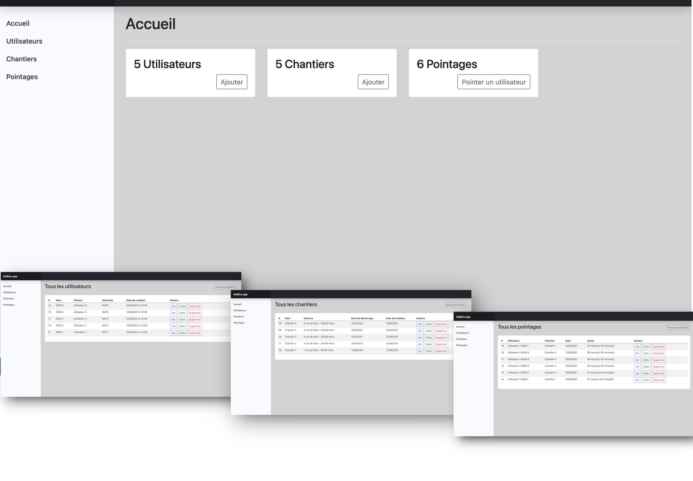

# Kalitics app

It is a simple application allowing to manage construction sites and the clocking of users who go to the site.

## Technical stack
- Symfony 4
- Bootstrap 5 (css)
- Vanilla JS




## How to set up your dev environment

### 1 - Clone the project and go to the directory
```bash
git clone https://github.com/qamar-h/kalitics.git
cd kalitics
```

### 2 - Copy the .env.dist to .env
```bash
cp .env.dist .env
```

### 3 - Adapt the docker-compose.yml to your environment

In the file find the container declaration "kalitics-test" 
and change the following
```bash
replace "/the/path/of/project" 
//replace it with the path of the folder containing the project previously clone from git
```

In the file find the container declaration "kalitics-db" 
and change the following
```bash
replace "/the/path/of/db/directory"
//create a directory on your disk and replace the following with the path of the newly created directory 
(watch out for permissions)

```

### 4 - Run the containers
```bash
make run
```

### 5 - Install php dependencies
```bash
make composer
```

### 6 - Install JS dependencies
```bash
make npm
```

### 7 - build assets
```bash
make asset
```

### 8 - Migrate the database
```bash
make db-migrate
```

### 9 - load demo data
```bash
make db-load-data
```

### 10 - End - Go to: 
```bash
http://localhost:8082
```